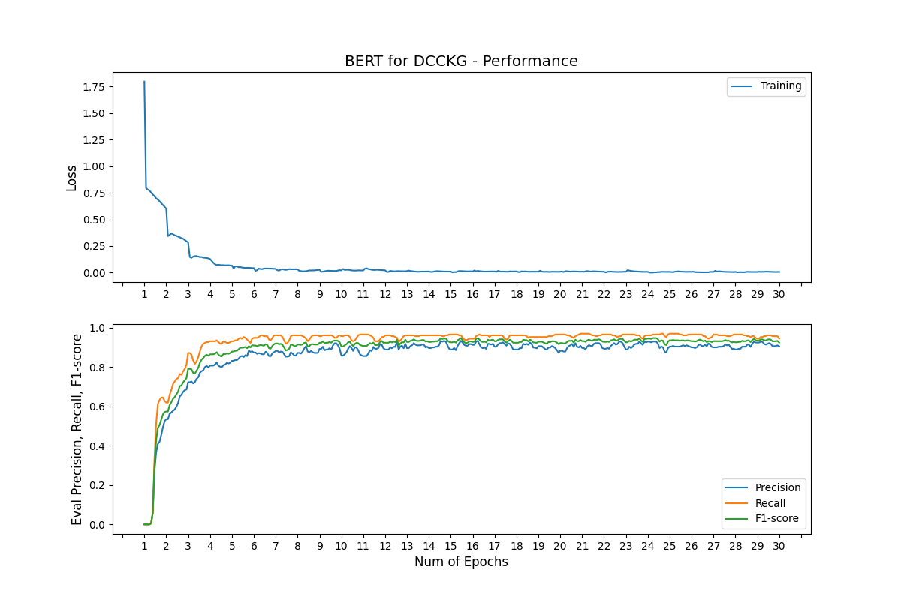

# DCCKG

This is the code repository for DCCKG.

Now, it includes:

* Dataset Preprocess example
* BERT NER example
* Result Postprocess plot example

## Quick Start

```shell
conda create -n DCCKG python=3.8
conda activate DCCKG

pip install -r requirements.txt

python run_bert_ner.py

cat checkpoints/eval_results.csv
```

## Result



## Reference

* [zjunlp/DeepKE](https://github.com/zjunlp/DeepKE): v0.2.97
* [doccano/doccano-transformer](https://github.com/doccano/doccano-transformer): v1.0.2
* [lacusrinz/doccano-transformer](https://github.com/lacusrinz/doccano-transformer)
* [RocioLiu/bert_chinese_ner](https://github.com/RocioLiu/bert_chinese_ner)

